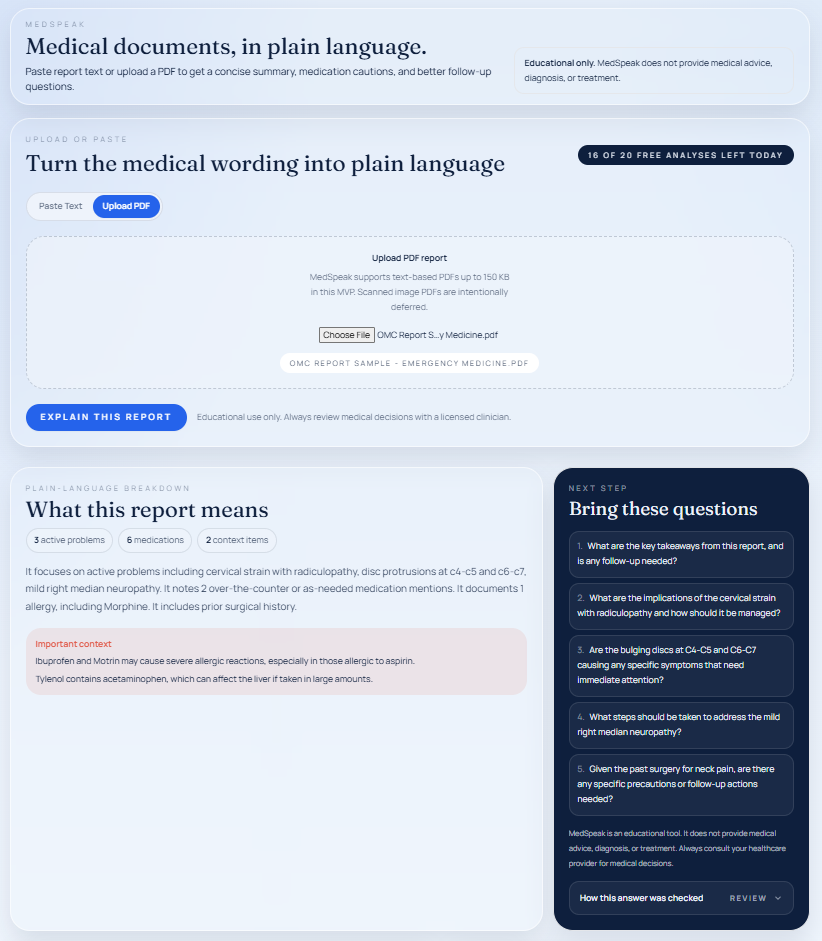
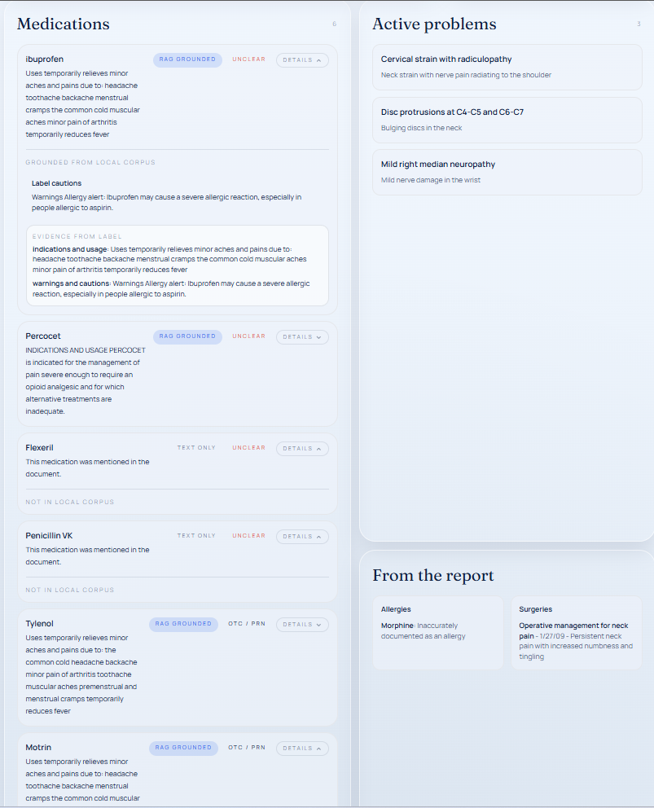
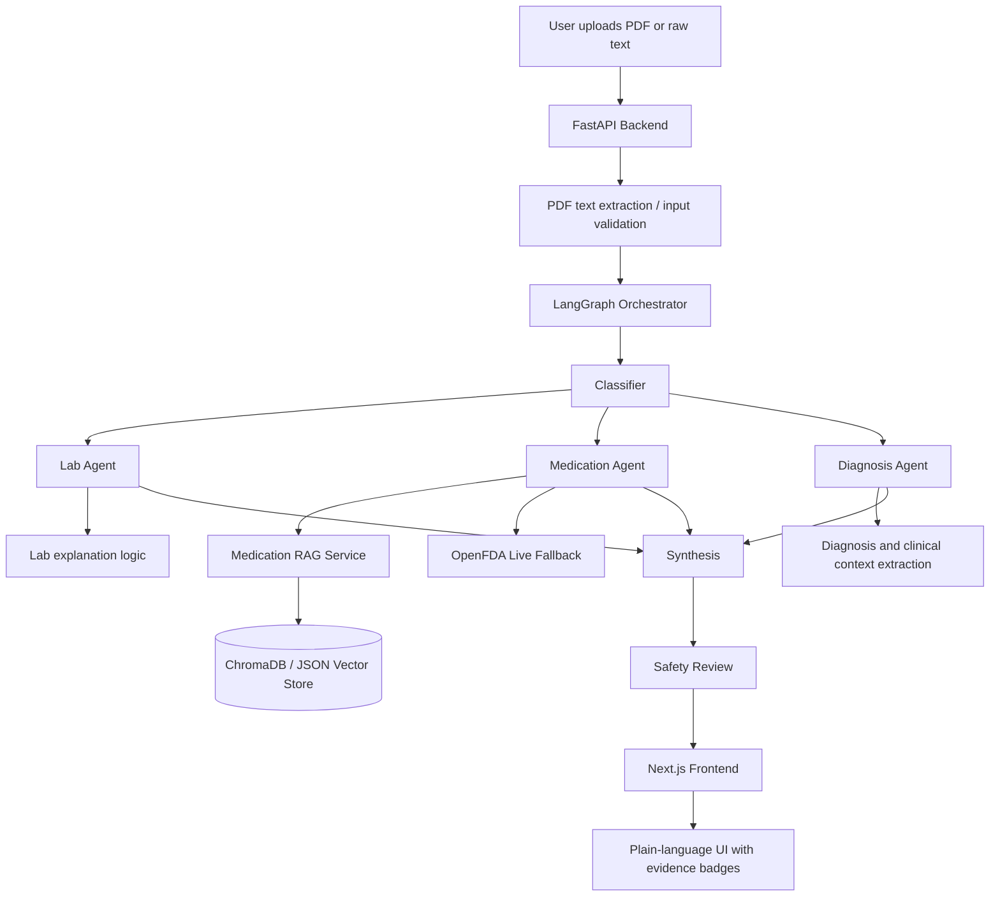
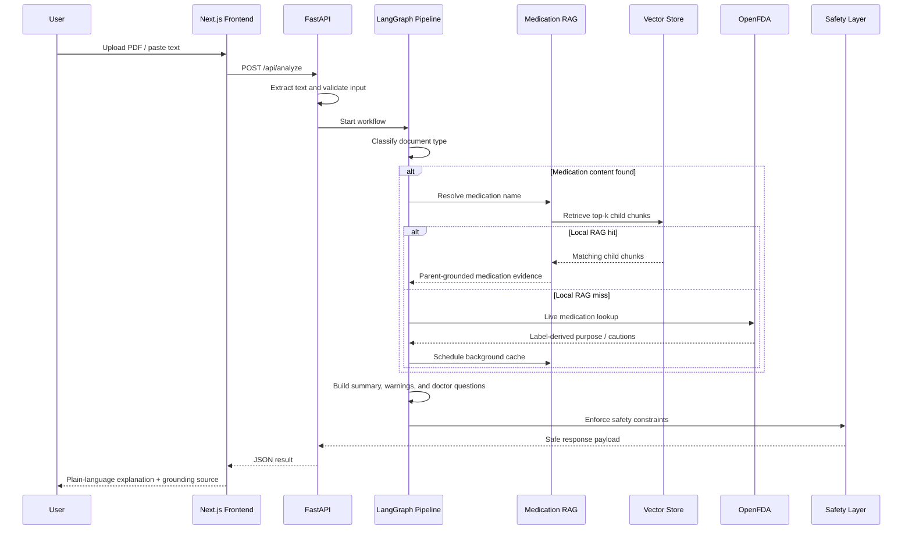

# MedSpeak

MedSpeak is an AI-assisted medical document explainer built as a FastAPI + Next.js monorepo. It accepts PDF uploads or pasted report text, extracts structured findings, and returns a grounded, plain-language explanation with medication context, warnings, and follow-up questions.





## Recruiter Summary

This project is a full-stack applied AI system designed to solve a practical healthcare communication problem:

- Patients often receive discharge summaries, medication lists, and lab reports that are technically correct but difficult to understand.
- Pure LLM summarization is fast, but risky for healthcare because it can sound confident even when it is not grounded in source evidence.
- MedSpeak combines workflow orchestration, retrieval, live data fallback, and a safety layer to produce explanations that are more transparent than a standard chatbot.

In business terms, the product idea is simple:

- reduce confusion after a visit,
- make reports easier to understand,
- surface medication context in plain language,
- and do it with visible evidence instead of black-box generation.

This is an interview/demo build, not a compliance-ready medical product. The value of the project is the engineering approach: grounded retrieval, explicit fallbacks, safety constraints, and a clear product tradeoff between speed, cost, and trust.

## Why This Product Exists

Healthcare documents create two problems at the same time:

1. The language is too technical for most patients.
2. Simplifying that language with a generic LLM can introduce unsafe phrasing around diagnosis, treatment, or dosing.

MedSpeak was built around that tension.

Instead of asking a model to freely explain everything, the system:

- classifies the document,
- routes it through specialized processing paths,
- grounds medication explanations with retrieved FDA evidence,
- falls back to live OpenFDA when needed,
- and runs a safety pass before anything is shown to the user.

That makes the system more trustworthy than a single prompt calling GPT on raw text.

## What The Application Does

- Accepts a PDF upload or raw medical text.
- Extracts report content on the backend.
- Detects whether the document is mainly about labs, medications, diagnoses, or mixed clinical context.
- Produces a patient-friendly explanation.
- Grounds medication explanations with local RAG or live OpenFDA.
- Shows evidence and source transparency in the UI.
- Adds a safety review that blocks or rewrites unsafe language.

## Product And Engineering Approach

The core design choice was:

**Do not treat this as a single chat prompt. Treat it as a workflow.**

That led to four architectural decisions:

### 1. Multi-step orchestration instead of one-shot prompting

The backend uses a LangGraph workflow with dedicated nodes for:

- document classification,
- lab analysis,
- medication extraction and grounding,
- diagnosis and context extraction,
- final synthesis.

This keeps the system easier to debug and lets each step fail gracefully instead of collapsing the whole experience.

### 2. Ground medication answers instead of relying on model memory

Medication explanations are the highest-risk part of the app, so MedSpeak does not rely only on the LLM's built-in knowledge.

It uses a local medication corpus built from OpenFDA label data. At query time, the system retrieves relevant chunks and uses them to ground the explanation.

### 3. Keep request-time latency low

Chunking and embedding do not happen on the common request path for seeded medications.

If a medication is missing from local RAG:

- the system falls back to live OpenFDA,
- returns the response,
- then schedules background caching for future local retrieval.

### 4. Add explicit safety controls

Even grounded answers can still be phrased in a risky way. After synthesis, the app runs a deterministic safety review that flags diagnosis, treatment, and dosage-like wording and rewrites or replaces it.

## High-Level Architecture



### High-Level Explanation

- The frontend is a thin client.
- The backend owns extraction, orchestration, grounding, and safety.
- Medication understanding is the most retrieval-heavy part, so it has its own RAG service.
- OpenFDA is both a corpus source and a live fallback source.
- The UI does not just show an answer. It shows where the medication explanation came from.

## Detailed Request Flow



### Why This Flow Matters

- It separates retrieval from generation.
- It keeps the fastest path simple.
- It handles missing medication data without blocking the entire request.
- It makes the system observable: each step has a clear role.

## Medication RAG Design

This is the most interesting technical subsystem in the project.

### Corpus Source

- Seed corpus of **12 medications** ingested from OpenFDA.
- Stored locally under `backend/data/chroma`.

### Chunking Strategy

The app now uses **parent-child chunking** for medication labels:

- small **child chunks** for precise retrieval,
- larger **parent chunks** for grounded explanation context.

Why this was the right tradeoff:

- FDA labels are already structured by section,
- retrieval benefits from smaller chunks,
- explanation quality benefits from larger surrounding context.

### Embedding Strategy

- OpenAI embeddings are used when configured.
- Deterministic fallback embeddings exist for offline/dev mode.
- ChromaDB is preferred; a persistent JSON fallback is used if `chromadb` is unavailable locally.

### Retrieval Strategy

- Resolve medication aliases first.
- Embed the query.
- Retrieve top child chunks.
- Deduplicate by parent.
- Use parent context to ground the answer.

### Incremental Ingestion

The latest version supports incremental ingestion:

- unchanged medication documents are skipped,
- changed medications are re-embedded,
- removed medications are deleted from the corpus,
- live OpenFDA misses are cached asynchronously for future retrieval.

This avoids paying the cost of rebuilding the full corpus every time.

## Why I Did Not Use A Reranker

I intentionally did **not** add a reranker because the retrieval problem was still low-entropy:

- the corpus is small,
- medication names are resolved before retrieval,
- FDA label sections are already structured,
- and the first-stage retrieval was good enough for this scope.

A reranker would have added:

- more latency,
- more cost,
- and more complexity,

before there was evidence that ranking quality was the actual bottleneck.

That is an example of a broader engineering principle in this project:

**Only add retrieval complexity when the evals show a real need.**

## Safety And Trust Decisions

Healthcare is a bad place for vague system behavior, so MedSpeak includes explicit guardrails:

- deterministic post-generation safety review,
- partial-data notes when a step falls back,
- grounded medication evidence in the UI,
- source transparency: `rag`, `openfda_live`, or `text_only`,
- bounded retries and graceful degradation when APIs fail.

This was an intentional product choice. I wanted the system to be honest about uncertainty rather than silently sounding polished.

## Tradeoffs And Scope Boundaries

What I chose to build:

- grounded medication explanations,
- structured workflow orchestration,
- retrieval evaluation,
- safety-aware output shaping,
- deployable backend and frontend.

What I intentionally kept out of scope:

- OCR,
- user accounts or patient history,
- compliance/HIPAA claims,
- long-term persistence of user documents,
- broad medical knowledge coverage beyond the seeded medication corpus.

This kept the project focused on demonstrating strong engineering judgment instead of pretending to solve all of digital health.

## Technical Skills Demonstrated

This project showcases:

- **Python backend engineering** with FastAPI
- **TypeScript / React / Next.js** frontend development
- **LLM orchestration** with LangGraph
- **RAG system design**: ingestion, chunking, embedding, retrieval, fallback
- **Vector storage** with ChromaDB and storage fallback design
- **Prompting and structured generation**
- **Safety-oriented AI product design**
- **API integration** with OpenFDA
- **Evaluation thinking** through retrieval and generation checks
- **Deployment and environment configuration**
- **Testing** across backend, frontend, and end-to-end paths

## What I Learned

This project changed how I think about building AI products.

### 1. Orchestration beats clever prompting

For applied systems, breaking the problem into nodes and contracts was much more reliable than trying to solve everything with one model call.

### 2. Retrieval quality is a product decision, not just an ML decision

Chunk size, fallback behavior, evidence display, and user trust are all connected. Good RAG is not just about nearest neighbors; it is about how retrieval affects the final experience.

### 3. In healthcare-like domains, honesty matters more than fluency

A slightly less polished answer with clear provenance is better than a very fluent but weakly grounded answer.

### 4. Evaluate before over-engineering

I explored ideas like rerankers, semantic chunking, and more complex embedding choices, but this project reinforced that system complexity should follow measured need.

### 5. UX quality is different from model quality

Even when retrieval is working, the output can still feel weak if summary shaping, warning compression, and question generation are not strong enough. That distinction became very clear while iterating on MedSpeak.

## Repo Layout

```text
backend/   FastAPI API, LangGraph pipeline, retrieval service, scripts, tests
frontend/  Next.js app, API proxy routes, UI tests, e2e tests
images/    README screenshots
PLANS.md   project notes, retrieval metrics, roadmap
```

## Local Setup

### Backend

```bash
cd backend
py -m venv .venv
.venv\Scripts\activate
py -m pip install -r requirements.txt
copy .env.example .env
uvicorn app.main:app --reload --port 8000
```

### Retrieval Scripts

```bash
cd backend
.venv\Scripts\python.exe scripts\ingest_openfda_labels.py
.venv\Scripts\python.exe scripts\evaluate_retrieval.py
.venv\Scripts\python.exe scripts\evaluate_generation.py --case mixed-discharge --judge-model gpt-4o-mini
```

### Frontend

```bash
cd frontend
npm install
copy .env.example .env.local
npm run dev
```

## Evaluation Notes

- A local retrieval evaluation script is included.
- The recorded sample retrieval result in `PLANS.md` showed **100% top-3 hit rate on 10 labeled queries** in the measured local configuration.
- Important caveat: that recorded run used the deterministic embedding fallback rather than OpenAI embeddings, so embedding-specific claims should be revalidated when OpenAI embeddings are enabled.

## Environment

- Backend API: `http://localhost:8000`
- Frontend app: `http://localhost:3000`

## Final Note

MedSpeak is not trying to be a production medical diagnosis system.

It is a deliberately scoped example of how to build a safer AI application:

- start from a real business problem,
- structure the system into explicit steps,
- ground risky outputs,
- make fallbacks visible,
- and keep engineering complexity proportional to what the use case actually needs.
